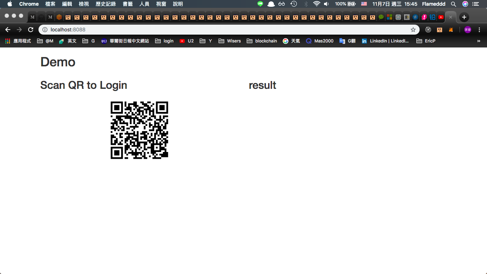

## install
 1. npm install
 2. visited: `localhost:8088`

## steps
 - 調整 `server.js` 裡面的 `DEFAUTL_PUBLIC_ADDR` 變數是否為測試的 public address
  > const DEFAUTL_PUBLIC_ADDR = '0x653b9a344accbb759462a661a73f90af28b73565'

 or 這樣訪問也可以
 - visited: `http://localhost:8088?account=0x653b9a344accbb759462a661a73f90af28b73565`

 - 接著開啟手機App，切換到要`簽名`的帳號去。
 - 掃描 qrcode
 - （確保輸入了 server 的位置）
 - `簽名`
